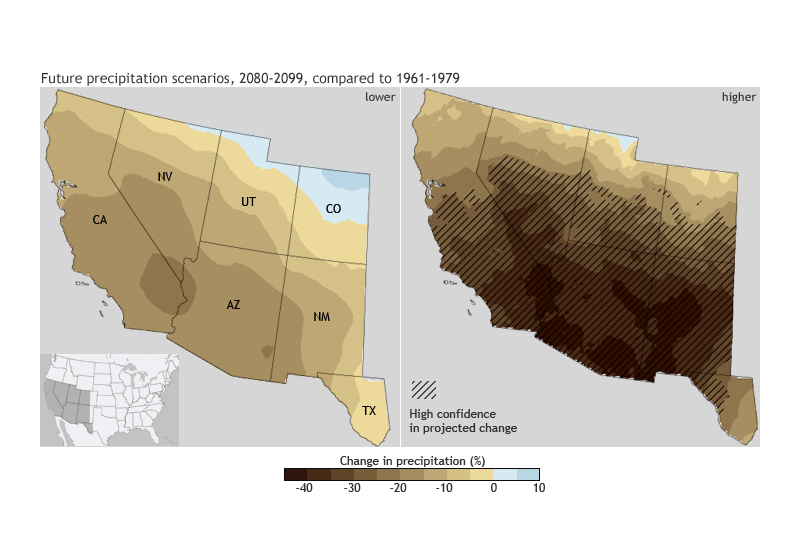

# Colorado River Water Resource Management

### The Problem

General synopsis:

Water resources are becoming an ever growing concern for resource managers all over the United States. 
The western states, in particular, struggle with water management among the various needs of modern society.

[Bar graph of water usage in Colorado Basin]

Specific future predictions:

<figure>

<figcaption align="center"><b>Image Credits - Fig.1 - Projected Precipitation from 
<a href="https://www.climate.gov/news-features/features/drought-rio-grande">Climate.Gov</a></b></figcaption>
</figure>

[Words about less water in future]

[time series graph of water storage in Colorado Basin]

### The Stakeholder

### The Situation at Current

### The Proposition

Better management through predictive modeling:

Adaptation to drying climates:

