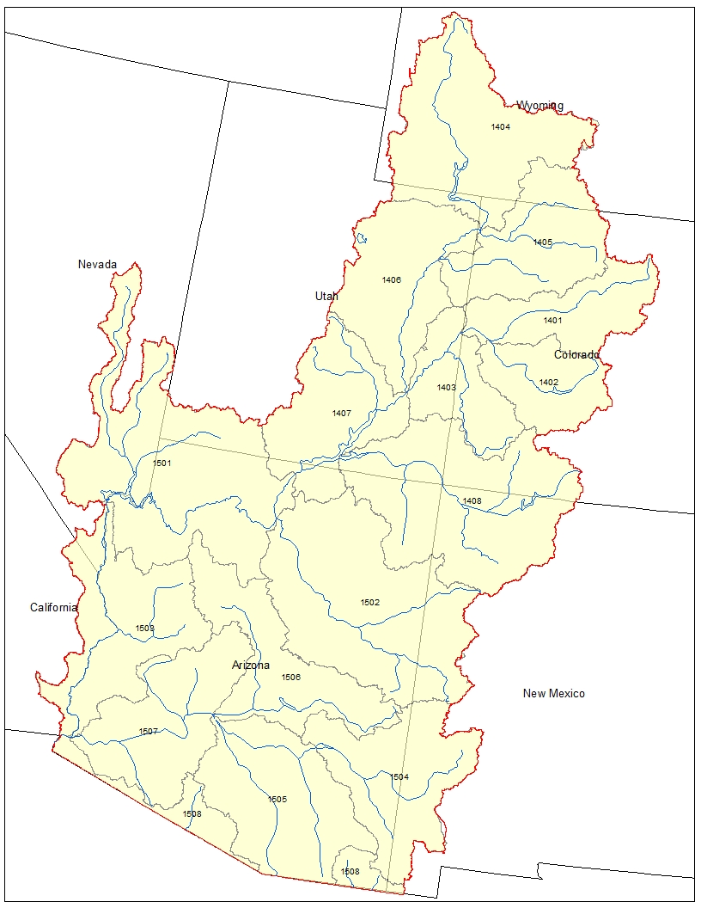
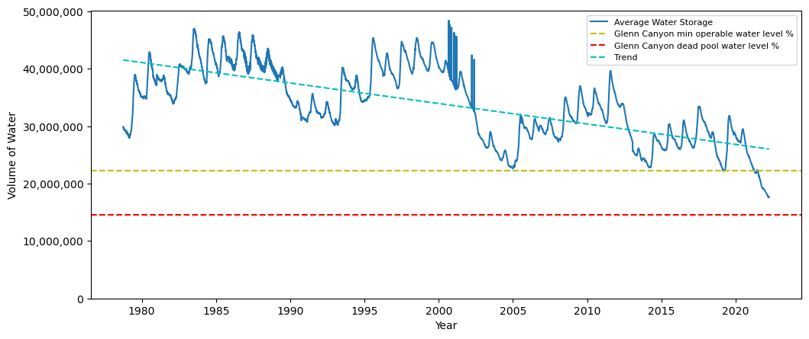

# Colorado River Water Resource Management

- Source data located in /00_Source_Data/
- Notebooks located in /Notebooks/
    - Source Python files in /Notebooks/src/
- Images and figures located in /images/
- PDF files for presentation and reports in /deliverables/

### A General Synopsis of the Southwestern Region's Water Problem

 

<figure style="text-align: center;">
<figcaption><b>Future Precipitation - 
<a href="https://www.climate.gov/news-features/features/drought-rio-grande">Climate.Gov</a></b></figcaption>

</figure>

The southwest region is dense in both population and agricultural land. The water from the region's basins supports
upwards of 92% of the region's agriculture (USDA). This accounts for nearly 79% of all water withdrawals in 
the region. In particular, California contains 70% of the regional crop area valued at $30.4 B in 2012. With the
region's agriculture, 35 to 40 billion people, and a US delivery obligation to Mexico depending on water resources
from the region's basins, proper management and documentation of the region's water resources is essential (Bureau of 
Reclamation, 2016).

<figure style="text-align: center;">
<figcaption><b>Colorado River Basin Extent - USGS</b></figcaption>

</figure>

The Colorado River Basin (pictured above) is one of the larger river basins in the southwest region. The 
Colorado River Basin (CRB) supports the water needs of seven basin states, California among them, along with supplying an
amount to Mexico determined by a 1944 treaty with Mexico. With expected rise in water demand and projected water
supply decreasing, we investigated predicted modeling as an answer to planning needs for the CRB. These models provide
actionable predictions for management at dam level operations.

<figure style="text-align: center;">
<figcaption><b>Water Storage in CRB (dam3)</b> </figcaption>

</figure>

### Tools for Water Management Agencies

While all dams have different operating and dead-pool depths based on their engineering, we used Glenn Canyon dam 
as a model. Each dam can potentially customize similar modeling procedures for their own operating depth requirements.
The current trend sees water storage declining since 1976. Today Glenn Canyon dam is on the verge of dead-pool depths.
By including time series data on Snow Water Equivalence (SWE) from weather stations in the basin and water storage for 
each dam in the basin, we can create a classification model that will predict the functional depth of the water with
an accuracy of approximately 97%.

### Data

Data was collected from U.S. Department of Agriculture's (USDA) 
<a href='https://www.nrcs.usda.gov/wps/portal/wcc/home/snowClimateMonitoring/snowpack/'>Snotel</a> and 
<a href='https://www.nrcs.usda.gov/wps/portal/wcc/home/waterSupply/'>water supply</a> programs. Water withdrawal
data was collected from the U.S. Geological Survey's (USGS) database.

#### Snotel Data

The USDA's Snotel data includes snow water equivalent measurements throughout the western United States. We clipped the
original data using a shape file from USGS for the Colorado River Basin (CRB) to extract just stations within the CRB.
These SWE measurements were then averaged using a median for each day in the data going back to 1976 from current. We 
acknowledge that this approach generalizes the value over a large area, but given the accuracy of the model, we found
the averaging to be sufficient. We may look into separating stations by downstream dam in a more granular approach to
this modeling method in the future.

#### Water Supply Data

The USDA's water supply data primarily consists of reservoir volume readings. Each reservoir in the CRB reports their
water level and volume each day from 1966 to present. Data from this set was aggregated by summation into a total water
volume for the CRB. We expect inaccuracies to come from in-stream volumes of water between dams. We also expect that 
inaccuracies may result from the construction of new dams within the data series. The aforementioned granular approach
by downstream dam would alleviate some inaccuracies resulting from this approach and is a method of interest in future
modeling.

#### Water Withdrawals Data

The USGS's water withdrawals data aggregates withdrawals with into a combination of fresh, saline, ground and surface 
water withdrawals every 5 years from 1985. This dataset also includes non-consumptive water uses and water uses that 
allow for flow-through. Here we aggregated water usage from assumed non-flow-through categories. Values in the dataset
were recorded in thousand feet acres and were converted to deca-meters cubed (dam3) to match the water supply 
data. The time between data recordings may cause some inaccuracy in classification. However, we assume these 
inaccuracies are minute given the minor variation in water withdrawals within the collection of samples over the large 
period of time they were collected. We performed a back-fill on the withdrawal data to each previous sample to fill out 
the dataset on this assumption. More frequent monitoring or collection of water withdrawal data could result in more 
accurate predictions.

#### Processing

All data was scaled prior to being fed into models to adjust for the differing scales of SWE and water storage values.
Target variables were calculated using specific operating and dead-pool depths from Glenn Canyon dam as a percentage of
the total depth of the dam. Two sets of targets were created. A binary operational/non-operational target and a trinary
target that includes non-flow-through depths for Glenn Canyon dam, or the dead-pool depth.

### Modelling

A dummy model was used to compare a simple logistic regression to the data. Following the first simple model, a grid
search was used to compare the logistic model with nearest neighbors (KNN) and random forest models. The resulting best 
model between the three was then compared to a TimeSeriesForest (TSF) model (Faouzi and Janati, 2020). We concluded that 
while the random forest model performed best on accuracy, it did not account for the seasonality of the time series data
and that the TSF model was better suited to the application.

The initial logistics model was conducted on both binary and trinary targets. The binary targets set for Glenn Canyon's
operating depth such that the outcome was either at or above operating depth or below operating depth. We felt that the
trinary target that included Glenn Canyon's dead-pool depth did not reduce the accuracy of the model significantly and 
better balanced the target set while providing the end-user with more information. The trinary logistic model performed
with an accuracy score of 94.8% on the hold-out data.

We comprised a second model from a grid search method to compare and tune a set of logistic, KNN, and random forest
models.The grid search was constructed to choose models for highest accuracy. The resulting best-model from this grid
search was a tuned random forest model with that performed with an accuracy of 98.3% on the hold-out data.

We constructed a third model using Faozi and Janati's TimeSeriesForest classifier to incorporate time series methods in
our model. We performed a gridsearch to tune the model within set hyperparameters and found a TSF model optimized for
the application. The TSF model performed with an accuracy of 97.2%. We feel that accounting for seasonality and other
facets intrinsic to time series data is worth the minimal loss in accuracy we see between the TSF and random forest
models in this application.

### Appendix

#### Documentation

<a href="https://docs.google.com/presentation/d/12ga7hI2sMFTskA3Yoye9iRho2kdFfZtiFXL372UtFrQ/edit?usp=sharing">[link]</a>
Presentation

#### Works Cited

<a href="https://www.usbr.gov/climate/secure/docs/2016secure/factsheet/ColoradoRiverBasinFactSheet.pdf">[link]</a>
RECLAMATION: Managing Water in the West. U.S. Department of the Interior: Bureau of Reclamation. 2016.

<a href="https://www.climatehubs.usda.gov/index.php/hubs/southwest/topic/focus-croplands-southwest">[link]</a>
Focus on Croplands in the Southwest. U.S. Department of Agriculture.

Johann Faouzi and Hicham Janati. pyts: A python package for time series classification. 
&emsp; &emsp; &emsp; Journal of Machine Learning Research, 21(46):1−6, 2020.
